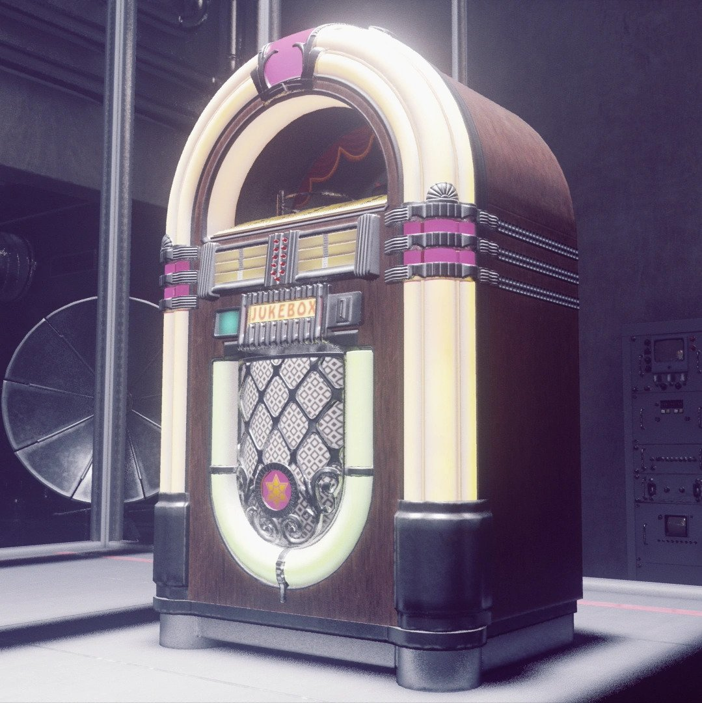

<div id="top"></div>

<!-- PROJECT LOGO -->
<br />
<div align="center">
  <a href="https://github.com/c1h1r1i1s1/SpotifyCrate">
    
  </a>

<h3 align="center">Spotify Crate</h3>

  <p align="center">
    Collect the music you listen to
    <br />
    <a href="https://github.com/c1h1r1i1s1/SpotifyCrate">Github Repo found<strong> Here »</strong></a>
    <br />
    <br />
    <a href="https://github.com/c1h1r1i1s1/SpotifyCrate/issues">Report Bug</a>
    ·
    <a href="https://github.com/c1h1r1i1s1/SpotifyCrate/issues">Request Features</a>
  </p>
</div>


<!-- TABLE OF CONTENTS -->
<details>
  <summary>Table of Contents</summary>
  <ol>
    <li>
      <a href="#about-the-project">About The Project</a>
    </li>
    <li>
      <a href="#getting-started">Getting Started</a>
      <ul>
        <li><a href="#prerequisites">Prerequisites</a></li>
        <li><a href="#installation">Installation</a></li>
      </ul>
    </li>
    <li><a href="#usage">Usage</a></li>
    <li><a href="#contact">Contact</a></li>
    <li><a href="#acknowledgments">Acknowledgments</a></li>
  </ol>
</details>


<!-- ABOUT THE PROJECT -->
## About The Project

Do you wish you had physical copies of the music you enjoy? One of the main downsides of Spotify is that you never really *own* the music. You can't keep a collection in your room. It all exists within the screen.

This project is intended to be run on a Raspberry Pi with an NFC hat.

Using the Spotify API, this project utilises nfc technology to attach our favourite Spotify albums and playlists to physical objects. Scanning an nfc tag against the connected nfc reader will automatically start playing the specified music from any Spotify device. With the implementation of <a href="https://github.com/dtcooper/raspotify">Raspotify</a>, we are also able to attach the Pi directly to a set of speakers, making the entire device standalone. 


<!-- GETTING STARTED -->
## Getting Started

This project has been mainly set up for the Raspberry Pi with an NFC hat, however it can be easily run on any system with Python 3 and a connected NFC reader.
To set up this project locally, you will need to create a spotify application that you can authenticate with. 

### Installation

1. Clone the repo
   ```sh
   git clone https://github.com/c1h1r1i1s1/SpotifyCrate.git
   ```
2. This section describes setting up your spotify app via the spotify developers dashboard.
   * Head over to `https://developer.spotify.com/dashboard/` and log in with your spotify account to create a developer account.
   * Once you have a developer account, create a new app with the 'Create An App' button on the dashboard.
   * After naming the app whatever you like and adding a description, you will be greeted with an overview of your new app.
   * By clicking on `Show Client Secret`, note down your Client ID and Client Secret;. You will need these for authentication.
   * Now click on `Edit Settings` and scroll down to `Redirect URI's`. This is the callback which gives the Pi your authentication details once you hace connected the app to the client Spotify device.
   * <b> For Pi devices: </b> All you need to add in the redirect URI's is `http://raspberrypi.local:8080/`. This is because you can access the Pi via it's hostname on your local network.
   * <b> For others: </b> As you need the program to redirect to your device via the same local address each time, you must have a reserved local IP address set for your device that you can use such as `192.168.0.8`. You would then add `http://192.168.0.8:8080` as the redirect URL. Otherwise, you could have your own hostname being broadcasted across the network such as 'mycomputer' which could then be accessed at `http://mycomputer.local:8080`. Note that in each case, port 8080 must be used.

3. Now that you have your app set up, open `cred.py` in the installation directory. Here you can input your client ID and client secret.

4. Run `auth.py` to give the app Spotify conectivity.

5. Install Raspotify as per the developer's instructions: <a href="https://github.com/dtcooper/raspotify">Raspotify</a>

<p align="right">(<a href="#top">back to top</a>)</p>

<!-- USAGE EXAMPLES -->
## Usage

First we have to write the album data to the nfc tag. To get the album URI (Spotify's unique code for every song/album/playlist), using the desktop or web player, click share, then hold control to show 'Copy Spotify URI'. Copy the code. Now run the writer program with:
   ```sh
   python3 writer.py
   ```
to start the program.

Once the program has started up and asks for the code, paste the code, removing the first two parts. E.G:
   ```sh
   spotify:album:2fYcpbTFptY9uRcaY56NRu
   ```
would become:
   ```sh
   2fYcpbTFptY9uRcaY56NRu
   ```

Once you have inputted the code, place the NFC tag on the reader to write the data to the tag.


To play a song, simply run the reader program with
   ```sh
   python3 reader.py
   ```
Scan an nfc tag on the reader, and the chosen album will begin playing from the Pi, or the first active Spotify device if you are not using Raspotify.
</p>


<p align="right">(<a href="#top">back to top</a>)</p>


See the [open issues](https://github.com/c1h1r1i1s1/SpotifyCrate/issues) for a full list of proposed features (and known issues).

If you have a suggestion that would make this better, please fork the repo and create a pull request. You can also simply open an issue or contact me directly via the details below.
Don't forget to give the project a star! Thanks again!

<!-- LICENSE -->
## License

Distributed under the MIT License. See `LICENSE.txt` for more information.

<!-- CONTACT -->
## Contact

Christian Fane - lolasocf@gmail.com.com

Project Link: [https://github.com/c1h1r1i1s1/SpotifyCrate](https://github.com/c1h1r1i1s1/SpotifyCrate)

<p align="right">(<a href="#top">back to top</a>)</p>


<!-- ACKNOWLEDGMENTS -->
## Acknowledgments

* Thank you to Spotify for their Developer Console services!
* Thank you to Raspotify for the ability to play Spotify directly on the Pi headlessly!

<p align="right">(<a href="#top">back to top</a>)</p>


<!-- MARKDOWN LINKS & IMAGES -->
<!-- https://www.markdownguide.org/basic-syntax/#reference-style-links -->
[issues-shield]: https://img.shields.io/github/issues/c1h1r1i1s1/SpotifyCrate.svg?style=for-the-badge
[issues-url]: https://github.com/c1h1r1i1s1/SpotifyCrate/issues
[product-screenshot]: images/screenshot.png
